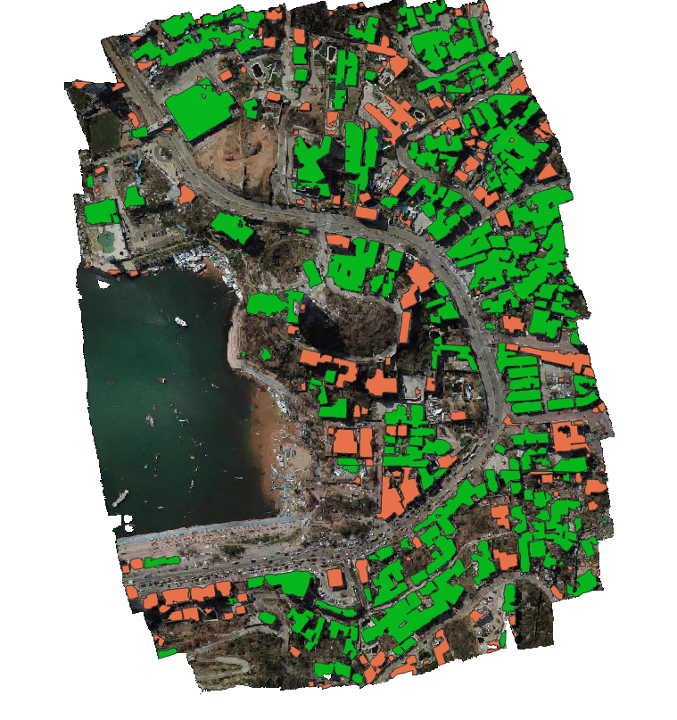

# DISCLAIMER
This scripted pipeline was developed to work on Windows 10 and as such is not guaranteed to work with Linux or iOS systems. 

# Folder contents
├── config
│   └── config_eval.yaml
├── cv2_supersample
│   └── EDSR
│   └── ESPCN
│   └── FSRCNN
│   └── LapSRN
├── input
│   └── Default path of input_dir in config file
├── models
│   └── ave.pth
│   └── f_api_Moza_and_Ita_FN_v2.hdf5
│   └── Mozambique_damage_detection_fn.hdf5
├── outputs-eval
│   └── Generated on script run and contains all results
├── temp
│   └── All temporary intermediate files are saved here and cleaned at the end of each run. 
├── adaptive_sieve_functions.py
├── building_segmentation.py
├── damage_classification.py
├── dataset.py
├── DEEP_class.txt
├── DEEP_class.yml
├── DEEP_seg.txt
├── DEEP_seg.yml
├── DEEPGis.py
├── gdal_polygonize.py
├── gdal_sieve.py
├── inference.py
├── model.py
├── new_polygonize.py
├── ReadMe.md
├── spec-file.txt
├── tiling_functions.py
├── upsampling_functions.py
├── utils.py

# Environement setup:
* Conda or Miniconda is necesary to setup the environment.
  * I recommend Miniconda if you do not use Conda already. 
  * Both can be downloaded from:
    https://docs.conda.io/projects/conda/en/latest/user-guide/install/download.html

  * Check if the anaconda directory path is added to the Path environmental variable by testing if the `conda` command is
    recognizable in Command Prompt.
    * If not please add the anaconda directory path to the Path environmental variable
    * E.g. `C:\ProgramData\Miniconda3\Scripts`

To be able to run both building segmentation and damage classification two environments need to be installed.
Once Conda or Miniconda is installed, open a command prompt in the uzipped script folder (or navigate in command prompt to the folder) and run the following:

# Installing segmentation environment 
1. Create environment with necesarry packages
* `conda env create -f DEEP_seg.yml`
The necesarry libraries will be installed. 

If conflicts are found, use this approach.
1. Create a brand new environment
* `conda create -n <environment_name>`

2. Enter the environment
* `conda activate <environment_name>`

3. Install specific package versions from specific package channels 
* `conda install --file DEEP_seg.txt --copy`

4. Once the installation of the packages is done run the following
* `pip install efficientnet_pytorch`

# Installing building damage classification environment
1. Create environment with necesarry packages
* `conda env create -f DEEP_class.yml`
* The necesarry libraries will be installed. 

If conflicts are found, use this approach.
1. Create a brand new environment
* `conda create -n <environment_name>`

2. Enter the environment
* `conda activate <environment_name>`

3. Install specific package versions from specific package channels
* `conda install --file DEEP_class.txt --copy`

4. Once the installation of the packages is done run the following
* `pip install tensorflow`

# Running the pipeline:
Once the installation is complete calling the script can be done in two ways.

1. Place the georeferenced tif your area of interest into the `input` folder and run the pipeline by calling: 
* `python inference.py input_name=<name_of_georeferenced_tif.tif>` 
  * E.g. `python inference.py input_name=Moz_sample.tif`

2. Use a path to anywhere on your filesystem. 
* `python inference.py input_dir=<directory_absolute_path> input_name=<name_of_georeferenced_tif.tif>` 
  * E.g. `python inference.py input_dir=F:\Code\Fraunhofer\EDDA\ITWM_EDDA_GIT\Building_Segmentation\input input_name=Moz_sample.tif`
  
* The image will be tiled into the `temp` folder between runs and removed at the end of the script. 
  If you want to keep the tiles in between runs add `clear_temp=False` to the python call. 
* All results and intermediate results can be found in the `outputs_eval\<timestamp>` folder for each separate run if
  `show_intermediate=True` is added to the command line call. 
* The final results of the algorithm (segmentation mask and geojson of the damage classified building footprints) can be found
  in `outputs_eval\<timestamp>\segmentation`.
* Printed outputs of the script are saved in `outputs_eval\<timestamp>\inference.log` to track run times. 

* To run the script with up-sampling add “upsampling=True” to the script call
  * `python inference.py file_name=<name_of_file_in_”input”_dir> upsampling=True`
  * The default parameters are already set to the values that produced the best results on a Sentinel-2 test image.

